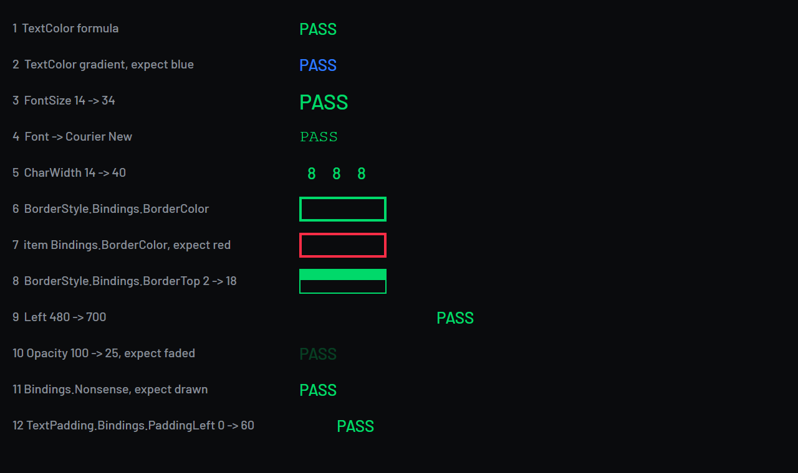

# ADR 0011: How far personalisation reaches into a generated package

**Date:** 2026-09-13
**Status:** Accepted. Moves the "theming and colour customisation" line in [scope.md](../scope.md)
and settles the shape of every ticket in the Personalisation project.

## Context

Everything OpenDash draws is resolved at build time into literal values: `"TextColor": "#FFF2CD11"`,
`"FontSize": 40.0`, `"Left": 516.0`. A setting changes a *running* dashboard only by being read
through a binding, so every thing a user might want to change is either something a binding can
reach or something only a different build can.

The twelve other tickets in the Personalisation project assume that question is answered. This is
not a document to write alongside them: [scope.md](../scope.md) refuses theming outright, and opens
its refusals with "work that falls under one of these lines does not belong in a pull request until
the line is removed from this document". So this record is the gate on the whole project, and the
table below is what the other tickets are waiting for.

The brief that opened this record carried three premises that were wrong. They are corrected here
rather than quietly dropped, because each one was load-bearing:

- **"The spike confirmed `TextColor`."** It did not. The spike verified `Width`, `BackgroundColor`,
  `Visible`, `Text`, `BlinkEnabled` and `InitialScreenIndex`; `TextColor` was only ever in the
  seen-in-the-wild list in [simhub-dash-format.md](../research/simhub-dash-format.md). It is
  verified now, by the probe below.
- **"Anything positional is not bindable."** `Left` is bound in shipping third-party dashboards and
  is verified here; `Top` is the same type on the same item and takes the same code path. Position
  is not the boundary.
- **"Item-level `Bindings.BorderColor` is silently ignored, so a frame's colour cannot be a runtime
  setting."** The first half is true and the conclusion does not follow. `BorderColor` lives on the
  `BorderStyle` sub-object, which carries bindings of its own. See below.

## What SimHub actually binds

Decompiled from SimHub 9.12.6 and then run on the VM as `OpenDash Probe`
([tools/binding-probe](../../tools/binding-probe/probe.ts)), which draws one row per question with a
literal that reads FAIL and a binding that reads PASS, so no telemetry is needed to read the answer.

Three mechanisms decide everything, and none of them is a list of blessed property names.

**A binding target is resolved by reflection, once, and failure is silent.**
`BindingHelper.InitBinding` does `item.GetType().GetProperty(propertyName)`. When the property does
not exist it leaves `ValueGetter` null, and `EditorModel.Applybindings` returns on exactly that
check. There is no log line and no editor warning: the item simply keeps its literal. This is the
same failure shape as the NCalc arity trap recorded in
[simhub-dash-format.md](../research/simhub-dash-format.md), and it is why the generator's
`BindingTarget` union is a whitelist rather than a `string`.

**The bindable types are `string`, `int`, `double`, `bool`, `Color` and `Brush`.** That set appears
twice, and the two agree: `PropertyItemWrapper` offers the binding editor only for those types, and
`Applybindings` has a branch for each and no `else`. A property of any other type cannot be bound at
all, which rules out `FontWeight`, `HorizontalAlignment`, `TextWrapping`, every other enum and every
collection. This is the real boundary, and it is a type boundary rather than a semantic one.

**Bindings nest one level into sub-objects.** `ApplyBindings` walks
`GetBindableProperties(item.GetType())`, which is every public property whose type implements
`IBindable` and is not itself an item, and recurses into each. On a drawable item those properties
are `BorderStyle` and, for text, `TextPadding`. Both derive from `SubPropertyBindingBase`, both
carry their own `Bindings` dictionary, and the item's `Owner` setter wires them up as it is
assigned. So the frame's colour, its four thicknesses and its four corner radii are all bindable,
under `BorderStyle` rather than under the item. The generator's note was right about the spelling it
tried and wrong about the conclusion it drew.

### The verified table

| Target | Type | Bindable | How it was established |
|---|---|---|---|
| `Text` | string | yes | spike, 2026-09-10 |
| `Visible` | bool | yes | spike; evaluated even when the item is hidden |
| `Width` | double | yes | spike |
| `BackgroundColor` | Color | yes | spike |
| `BlinkEnabled` | bool | yes | spike |
| `InitialScreenIndex` | int | yes | spike; moves a widget's screen live |
| `TextColor` | Color | yes | probe 1, formula mode |
| `TextColor` | Color | yes | probe 2, gradient mode (`Mode` 4) |
| `FontSize` | double | yes | probe 3 |
| `Left` | double | yes | probe 9; `Top` is the same type on the same item |
| `Opacity` | double | yes | probe 10 |
| `BorderStyle.Bindings.BorderColor` | Color | yes | probe 6 |
| `BorderStyle.Bindings.BorderTop` and siblings | int | yes | probe 8 |
| `TextPadding.Bindings.PaddingLeft` and siblings | int | yes | probe 12 |
| `ImagePath` on `ImageFromFileItem` | string | yes, on the face of it | an unattributed `string` property; not yet run on the VM |
| item-level `Bindings.BorderColor` | n/a | **no** | probe 7; the property is not on the item |
| an unknown target name | n/a | **no, silently** | probe 11; the item draws its literal and nothing is logged |
| `Font` | string | yes, and marked `[NoBinding]` | probe 4: the face changed to Courier New |
| `CharWidth` | double | yes, and marked `[NoBinding]` | probe 5: the monospace cells widened |
| `FontWeight`, alignments, `TextWrapping` | enums | **no** | not in the bindable type set |

**`Font` and `CharWidth` carry SimHub's `[NoBinding]` attribute, and both bind anyway.** The
attribute is read in exactly one place, `PropertyItemWrapper`, which is the editor's property grid.
`ApplyBindings` never looks at it, so a binding written into the JSON by hand is applied: probe 4
redrew its text in Courier New and probe 5 widened its monospace cells. That is a gap between what
SimHub supports and what it happens to do, and the font section below is why OpenDash does not
build on it.

## What it costs per frame

`EditorModel.ApplyBindings` runs over the rendered screen every frame. Four facts set the shape of
the cost, all from the same method:

- **Every binding of every visible item is evaluated every frame.** There is no dirty tracking on
  the formula: the expression runs, and only then is the result compared.
- **A hidden item costs one binding, not all of them.** `Visible` and `Repetitions` are evaluated
  first and the method returns before the rest if the item is not visible. Switching a page off is
  genuinely cheap.
- **The setter fires only when the value changed.** Each branch compares against `LastValue`, so a
  themed colour that nobody is changing costs an evaluation and a comparison, and never touches WPF.
  The expensive half of a binding is the half a static theme never reaches.
- **A binding that throws is muted for 30 seconds** and logged once. A formula that divides by zero
  does not stop the dashboard, and does not spam.

The counts, from the built packages. The worst case for one open dashboard is its main screen plus
the selected screen of each widget it includes, since a widget renders one of its screens:

| | items per frame | bindings per frame |
|---|---|---|
| `OpenDash zones 1920x480`, as it ships | 353 | 329 |
| the same face with every colour themed | 353 | 571 |
| `OpenDash Companion` | 133 | 52 |
| `OpenDash Pit wall` | 170 | 140 |

Full colour theming is therefore a **1.7x increase in binding count** on the heaviest face, not the
order of magnitude the brief feared. The twin used for that figure is generated by
[tools/binding-probe/themedTwin.ts](../../tools/binding-probe/themedTwin.ts), which is what the
colour tickets would emit: each literal becomes `isnull([OpenDash.Theme<n>], '<the literal>')`.

**What was measured, and what was not.** On the test VM, SimHub's own process time was sampled over
sixty-second windows. With no dashboard open and no telemetry arriving it used **0.042 CPU-seconds
per wall second**; with telemetry flowing and `OpenDash Companion` open, **0.111**. The difference
is an *upper* bound on what a dashboard costs there, about 0.07, because the second sample also
carries the telemetry the first did not.

The A/B that would have isolated the bindings, the reference face against its themed twin in one
session on one scenario, **was not obtained**. Dash Studio's automation could not reliably open a
named package (#308) and SimHub restarted repeatedly during the attempts. So there is no measured
cost per binding in this record, and the counts above are the evidence the decision rests on. That
is weaker than it should be and it is said plainly rather than dressed up.

It is weaker in a knowable direction, though. Every fact in the list above says the marginal binding
is cheap: it is an NCalc evaluation and a comparison, on a scene graph that already performs 329 of
them a frame, and it reaches WPF only when its value changes, which for a theme nobody is editing is
never. Whoever takes #127 should take the measurement with it, on a machine that will hold still.

**The ceiling is the item count, and it was already there.** A face renders around 350 items today
and already evaluates 329 bindings across them, because a dashboard that reads telemetry is mostly
bindings. Theming does not introduce a new cost model; it moves along one the product is already
on. What would introduce one is binding a property whose setter is expensive, a layout property that
forces WPF to re-measure every frame. That is a second reason `Left`, `Top` and `FontSize` stay
literal even though they bind.

## The decision

**Colour is a runtime setting. Geometry is a build input. Nothing regenerates a package on the
user's machine.**

Every thing a user might change falls into one of four buckets, and this is the table the rest of
the project is written against.

| A user wants to change | Bucket | Why |
|---|---|---|
| Surfaces, text levels, state colours, the accent (#127) | **Runtime** | `Color` targets bind; the literal becomes the `isnull` fallback |
| A theme preset (#99) | **Runtime** | A preset is a set of values the plugin writes to the same properties |
| Colour-vision palettes (#129) | **Runtime** | Same mechanism; the separation check is the plugin's, not the dash's |
| Night mode, and switching by itself (#128) | **Runtime** | The colour is a formula, so the switch can be an expression over the sim's time of day |
| Frame colour (#125) | **Runtime** | `BorderStyle.Bindings.BorderColor`, not the item-level spelling |
| Frame thickness and corner radius (#125) | **Runtime, bounded** | `int` targets on the same sub-object. A border eats the text box, so the bound range must be one `textFit` already proves |
| Frame on or off (#125) | **Runtime** | Thickness 0, or the item's `Visible` |
| The idle screen's image, logo and layout (#104) | **Runtime** | `ImagePath` is an unattributed bindable string, and a layout choice is a screen index, which the zones already prove |
| Typeface (#126) | **Build input** | Not because nothing binds, but because nothing re-measures. See below |
| A size step, a notch larger or smaller (#126) | **Build input** | `FontSize` binds and the box does not follow it; WPF clips what does not fit |
| Spacing, padding, radii as *layout*, positions (#131) | **Build input** | Every one of them was consumed by a layout decision in TypeScript |
| `font.cell`, the advances, the character budgets | **Build-time only** | Not a setting at any layer: they are how the boxes were measured, and a user changing one changes nothing but the truth of the measurement |
| A package built from the user's own tokens (#132) | **Build input, and the home of that bucket** | CI builds it; nothing runs on the user's machine |
| Regenerating a package locally | **Not possible** | It means porting the generator to C# or shipping a JavaScript runtime. [ADR 0003](0003-plugin-settings-through-properties.md) rejected it and it stays rejected |

### Why geometry does not become a runtime setting, even though it binds

This is the part the brief got backwards, and it matters because the mechanism is not the
constraint.

`Left`, `Top`, `Width`, `Height` and `FontSize` are all bindable. A generator that wanted to could
emit a face whose every rectangle is an expression. What it could not emit is the *guarantee*.
`packages/dash/test/textFit.test.ts` measures every text of every package against the box WPF will
clip it to, using the advances in `packages/dash/src/design/advances.ts` read from the bundled
fonts. `packages/dash/test/secondScreens.test.ts` does the same for every module in every box shape.
Those tests are why a glyph is never silently cut off on a real DDU.

A literal can be measured. A formula cannot: the test would have to prove a property, over every
value the expression can take, in a language with no types. So the moment a layout number becomes a
binding, the guarantee that replaces it is "we think it fits".

That is the line. **A property becomes a runtime setting when its value cannot change whether the
text fits.** Colour cannot. Position, size and face can. This rule also explains the two odd rows in
the table: a border thickness binds but is bounded, because a border eats the padding a value needs;
and a frame being switched off is free, because no box moves.

### Fonts: a curated set, and it is a build input

[#126](https://github.com/xorob0/OpenDash/issues/126) is right that an arbitrary system font is
unofferable, and right that the answer is a curated set of OFL faces, each with its advances
committed and each passing `textFit` for every package. This record adds where that set lives.

The tempting shape is runtime: bind `Font`, ship every face in `_SHFonts`, and require every
candidate to fit the boxes Barlow Condensed already fits, which is exactly #126's own acceptance
line, "switching face never moves a value's position, only its glyphs". It is rejected for three
reasons, in increasing order of weight:

1. `Font` and `CharWidth` are the two properties on a `TextItem` that SimHub marks `[NoBinding]`.
   They bind today, because only the editor reads the attribute, and the probe shows both working.
   But an editor that refuses to offer them is a statement about what its author considers
   supported, and a behaviour that works only because nothing enforces the attribute is one SimHub
   update away from being a silent regression. Silent is this format's specialty.
2. A face that must fit every box Barlow Condensed fits is a face chosen for its metrics rather than
   for its character, which is most of what a different typeface is for.
3. `font.cell` and the advances are build-time layers. A runtime face swap would leave both
   describing the face that is no longer being drawn, so the monospaced numerals, which is every
   value on the dash, would be laid into cells measured for a different font. Rebinding `CharWidth`
   only moves the problem: the cells would then be right and the *boxes*, sized from the old cells,
   would not.

So a typeface is a token, a token set is a build, and a build a user does not run is
[#132](https://github.com/xorob0/OpenDash/issues/132). That ticket stops being a nice-to-have and becomes
the delivery mechanism for the whole build-input bucket.

**Variant packages are rejected.** Ten faces times three typefaces times four themes is a release
nobody can navigate and a dashboard manager nobody can read. The curated set could ship as extra
packages later if somebody asks, but it is not the default answer and it is not what this record
schedules.

### The no-plugin case

Unchanged, and it is a standing requirement rather than a nicety: every themed expression is
`isnull([OpenDash.<name>], '<the token>')`, so a user who installs only a `.simhubdash` gets exactly
today's colours. The twin built for the measurement above renders identically to the original with
no plugin present, which is the check that this is true rather than intended.

One consequence is worth stating plainly: **a themed package with no plugin costs the bindings and
gets nothing for them.** That is the price of the standalone promise and it is the same price ADR
0003 already accepted.

## Consequences

### Good

The seven tickets this record blocked are unblocked, and each one now knows its shape before it is
designed. #127, #99, #128, #125 and #104 are runtime work against properties verified
above; #126 is a build input whose home is #132; #131 is both, and splits. #129 was never
blocked and is unaffected except that its palettes are now something a user can actually apply.

`BorderColor` is bindable after all, so [#125](https://github.com/xorob0/OpenDash/issues/125) is a whole
ticket rather than the "possibly nothing" it had been reduced to.

The generator learns a real capability: bindings on sub-objects. `packages/generator/src/model.ts`
records the corrected fact.

### Bad

A themed face evaluates 571 formulas a frame rather than 329, and that cost is paid by every user,
including the ones who never change a colour, unless the generator emits the literal when no theming
is enabled, which is a build flag and a second scene graph to keep tested. How much it actually
costs is not measured here, which is the weakest part of this record.

Two tickets are smaller than they read. #126 loses its runtime face switch, and #131's "edit any
token" splits down the middle: the colour layers are live, the size and spacing layers are a build.

### Unresolved

**What a themed face actually costs, measured.** The counts say the bindings roughly double and
every mechanism above says the marginal one is cheap, but the A/B was not obtained here. #127 owes
it.

**Whether the generator should emit a themed face at all, or only on a flag.** Nothing says the cost
is free, and a standalone package with no plugin pays it for nothing. A build flag buys the literal
back and costs a second scene graph to keep tested. This is the first question #127 has to answer
and it is not answered here.

**`ImagePath` is verified as a property, not as a behaviour.** #104 needs to know what SimHub does
with a path that does not exist, a file replaced while the dash is open, and an image larger than
the screen. Its own acceptance criteria already say so.

**What a round face does with any of this.** [ADR 0006](0006-the-zone-face.md) leaves the round
faces on the card model, and nothing here changes that.
